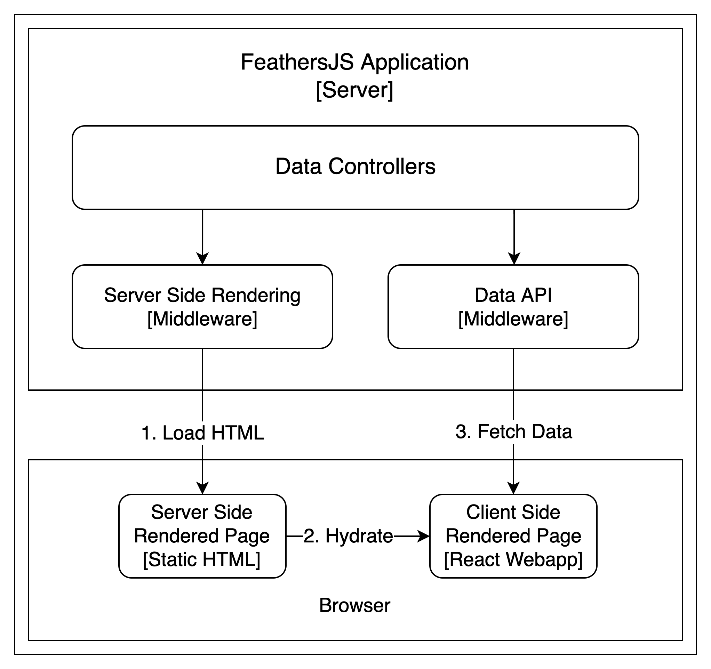

# Full Stack TypeScript Server Side Rendering with Umijs and FeathersJS

> This is a full stack TypeScript Server-Side-Rendering with React/UmiJS and FeathersJS.

## Quick Start

```bash
# Install dependencies and compile web frontend project.
bash deploy-web.sh
# Start web server.
cd server && npm start
```

Open <a href='http://localhost:3030' target='_blank'>http://localhost:3030</a> in browser.

## How Does It Work?



1. Server Side Rendering middleware renders `static html page` with `data controllers`.
2. Browser loads the `static html page`, and run [hydration script](https://reactjs.org/docs/react-dom.html#hydrate) to swap the `root div` with a React web application after the `static page` is loaded.
3. React web application `navigates` and `renders` pages from client side, and fetches data from API that shares the same `data controller` with `server side rendering middleware`.


## Server

### Enable Allow JavaScript

Since Umijs' Server Side Render is exported as a JavaScript module, you need to `allowJs` in `tsconfig.json`, so that the JavaScript module will be copied to `lib` directory in `production` mode.

While `allowJs` is set to true, you'll also need to exclude `public` directory in `tsconfig.json` to avoid compiling `public` directory.

```json
{
  "compilerOptions": {
    "allowJs": true
  },
  "exclude": [
    "public"
  ]
}
```
